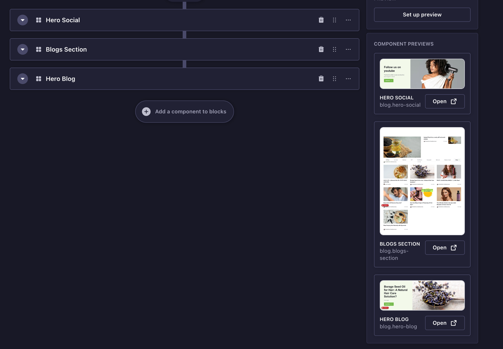

# strapify-preview

Author - Pratham Bhatia

---

## Preview



Content editors in Strapi have no idea what a component looks like without opening the website. This skill fixes that. It goes through every CMS component, screenshots it from the live website using real content, and shows it inside the Strapi admin as a side panel whenever you're editing.

You run one command and it handles everything. No setup, no config files to touch.

---

## How to use it

Open Claude Code and type:

```
/strapify-preview
```

It will ask you two things before starting:
- Which website repo and branch to use (e.g. "avimee website, main branch")
- Which Strapi environment to pull content from (e.g. "uat" or "prod")

That's all the input it needs. After that it runs fully on its own.

### How the agent works

When you run `/strapify-preview`, Claude acts as an autonomous agent. It reads the skill instructions once, then works through every step by itself, reading files, writing code, running terminal commands, and fixing things when they go wrong, all without you having to do anything. You can watch it work or just come back when it's done. It prints one summary at the end showing what was captured and what was missed.


### Run Claude with --dangerously-skip-permissions for the best experience

```
claude --dangerously-skip-permissions
```

This lets the skill run without stopping to ask you to approve every terminal command. It is safe because the skill never pushes anything to git, it only makes local changes. If you don't use this flag, Claude will pause for approval on every bash command which makes the run much slower.

---

## How it works

The skill writes a temporary page (`/strapify-preview`) into the website branch you specify. This page imports every component map from the codebase, fetches real content from your Strapi environment, and renders all components at once. Each component is wrapped in a `div` with a `data-strapi-uid` attribute that maps it back to its Strapi component ID.

Playwright then visits this page, reads the sitemap to understand the full URL space, and takes a cropped screenshot of each `data-strapi-uid` element. Once screenshots are captured, the temporary page is deleted and the branch is left exactly as it was.

After that, a set of purpose-built Node scripts handle the rest without needing Claude to process any of it. One script updates the Strapi component schema JSON files to point to the screenshots. Another writes a manifest. Another patches the Strapi admin panel. Claude just calls these scripts and reads the result. This keeps token usage low and makes each step fast and reliable.

```
ask which repo, branch and strapi env to use
    -> find repos, checkout branch
    -> read component maps from website code
    -> sniff data-fetching architecture (direct Strapi or proxy)
    -> find valid content handles per page type
    -> write temporary /strapify-preview page with all components + data-strapi-uid attributes
    -> start website dev server
    -> Playwright reads sitemap, visits /strapify-preview, screenshots each data-strapi-uid element
    -> delete temporary page, branch restored to clean state
    -> script: update Strapi component schema JSONs with screenshot paths
    -> script: write manifest.json
    -> script: install preview panel in Strapi admin
    -> build and restart Strapi
    -> done, open Strapi admin to see previews
```

---

## What gets changed

| Where | What |
|---|---|
| `strapi/public/uploads/component-previews/` | Screenshot files + manifest.json |
| `strapi/src/components/**/*.json` | Preview path added to each captured component |
| `strapi/src/admin/app.tsx` | Registers the preview side panel |
| `strapi/src/admin/components/ComponentPreviewPanel.tsx` | The panel component itself |
| Website repo | Nothing, the temporary page is deleted after capture |

---

## It will never push to git

The skill adds a git push block to both repos at the start of every run. Even if something goes wrong mid-run, no code will be pushed anywhere. All changes stay local.

---

## Running it again later

If you add new components to the CMS, just run `/strapify-preview` again. It reads the manifest from the previous run, skips components that already have screenshots, and only captures new ones.

To recapture everything from scratch:

```
/strapify-preview --force
```

---

## Requirements

- Both repos cloned locally
- Node.js installed
- Nothing else. Playwright is installed temporarily during the run and cleaned up after
